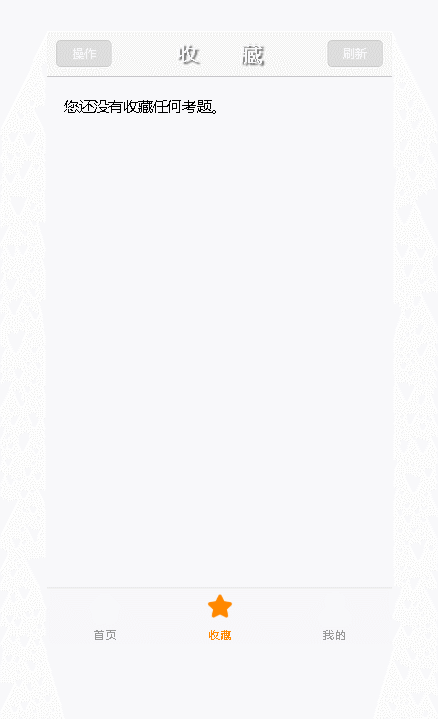

# 练习项目-基于VUE-cli的一个驾考题目练习项目
## 本项目数据资料来源网络，所以题目可能有些小问题，为了方便使用和练习，将题目拷到本地做成了数据接口

## 本项目用到的辅助插件
- vue-avatar-editor
  - [参考文档](https://github.com/two20/vue-avatar-editor)
  - 这是一个包含头像上传并剪切的工具
  - 通过该工具的方法最后会返回一个canvas
  可以通过`toDataURL()`转换成base64并添加到图片上
  - 由于base64过大，服务器可能会报错，请求过大，
  需要在服务器中给`body-parser`设置一个较大的limit,
  这样在服务端才能接受到

## UI的使用
- 由于以前已经用过ElementUI，MUI，等，这次用了一个没用过的
### WE-UI
- [参考文档](https://wevue.org/doc/v2/index)
## [点击查看服务端代码](https://github.com/songcn2010/drive_server)
## 预览图

- 录制gif的工具稍卡
## 打包测试
- [下载地址](https://pan.baidu.com/s/13yNW25tO35VcqUvMxaoKlw)
  - 提取码：c3o9
- 真机测试正常
## 在线测试地址
- http://39.108.64.147:8888
- 如果以上地址不行，可能是用于测试的云服务器没开启，可以试试http://drive.nat123.cc:34567
- 由于云服务器配置较低，可能响应速度会有点慢,可能会影响某些功能的响应
- 推荐使用打包后的apk安装测试
### 测试结果
- 真机测试正常
- 浏览器测试正常(由于服务器配置较低，响应速度略显不足)
# 由于只有一个自用做测试的云服务器，有时候其他操作可能可能会影响到服务的响应
# 本项目程序内设置的请求路径均为穿透后的公网路径
  - 如需修改，可在conf文件夹中index内的proxytable修改
    - 另一个在center中的login组件内，验证码的地址，验证图片有个初始请求，下面method中有个刷新验证码的路径需要修改
  - 所有请求均已设置区分开发和生产环境，并设置为axios的基础路径
# 由于是自己空闲做的娱乐项目，挂的自己的阿里云，可能会出现服务没有开启的情况
